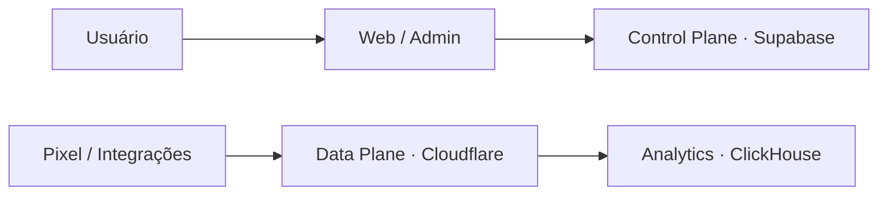

# Funnel Analytics

SaaS de analytics de funis da Prisma Group. Este monorepo separa o Control Plane operacional do Data Plane de eventos e foi preparado para evoluir por Epics.

## Estado do EPIC 00

- Next.js App Router para `apps/web` e `apps/admin`
- TypeScript strict, pnpm e Turborepo
- Tailwind CSS e pacote de UI compartilhado preparado para shadcn/ui
- Clientes Supabase separados para browser e servidor
- validação tipada de ambiente
- endpoint `/api/health` sem dados sensíveis
- logger estruturado com contexto técnico permitido
- Vitest, Playwright e GitHub Actions
- configuração local versionada do Supabase
- configuração de Preview Deployment para Vercel

Não há schema de negócio, billing, Funnel Builder, Pixel ou workers funcionais neste Epic.

## Arquitetura



O browser nunca recebe credenciais privilegiadas e nunca acessará ClickHouse diretamente. Consulte [Arquitetura](docs/architecture.md).

## Estrutura principal

```
apps/
  web/                   painel do cliente
  admin/                 painel interno
  collector/             shell do coletor
  *-worker/              shells de processamento
packages/
  config/                ambiente, constantes, TypeScript e ESLint
  db/                    clientes Supabase
  event-contracts/       contratos mínimos
  observability/         health e logger estruturado
  ui/                    componentes compartilhados
  */                     shells dos próximos Epics
infra/                   decisões por provedor
supabase/                config, migrations, seed e testes
tests/e2e/               smoke tests Playwright
docs/                    arquitetura e operação
```

## Requisitos locais

- Node.js 22 ou superior
- pnpm 11.19.0
- Docker Desktop, apenas para executar a stack local completa do Supabase
- acesso aos projetos GitHub, Supabase e Vercel da Prisma

## Instalação

1. Clone o repositório e entre na pasta:

   ```bash
   git clone https://github.com/agencia-prisma/funnel-analytics.git
   cd funnel-analytics
   ```

2. Instale as dependências:

   ```bash
   pnpm install --frozen-lockfile
   ```

3. Crie o ambiente local:

   ```bash
   cp .env.example .env.local
   ```

4. Preencha somente as variáveis necessárias. O build do EPIC 00 funciona sem secrets.

5. Inicie o painel do cliente:

   ```bash
   pnpm dev:web
   ```

6. Acesse `http://127.0.0.1:3000` e `http://127.0.0.1:3000/api/health`.

Para iniciar os dois apps simultaneamente, use `pnpm dev`. O admin utiliza a porta 3001.

## Variáveis de ambiente

| Variável                               | Escopo                 | EPIC 00                       | Uso                             |
| -------------------------------------- | ---------------------- | ----------------------------- | ------------------------------- |
| `NEXT_PUBLIC_APP_URL`                  | público                | opcional                      | URL canônica do web app         |
| `NEXT_PUBLIC_SUPABASE_URL`             | público                | necessária para usar Supabase | URL do projeto                  |
| `NEXT_PUBLIC_SUPABASE_PUBLISHABLE_KEY` | público                | necessária para usar Supabase | chave publicável                |
| `SUPABASE_SERVICE_ROLE_KEY`            | servidor               | não usada                     | operações privilegiadas futuras |
| `HOTMART_*`                            | servidor               | não usadas                    | billing futuro                  |
| `CLICKHOUSE_*`                         | servidor               | não usadas                    | analytics futuro                |
| `REDIS_*`                              | servidor               | não usadas                    | cache futuro                    |
| `CLOUDFLARE_*`                         | servidor               | não usadas                    | ingestão e archive futuros      |
| `RESEND_*` / `SENTRY_*`                | servidor conforme caso | não usadas                    | notificações e erros futuros    |

Nunca prefixe secrets com `NEXT_PUBLIC_`. Valores reais ficam em `.env.local` ou nos ambientes da Vercel e nunca no Git.

## Comandos

| Comando             | Resultado                     |
| ------------------- | ----------------------------- |
| `pnpm dev`          | inicia apps com Turborepo     |
| `pnpm dev:web`      | inicia web na porta 3000      |
| `pnpm dev:admin`    | inicia admin na porta 3001    |
| `pnpm lint`         | executa ESLint                |
| `pnpm typecheck`    | valida TypeScript strict      |
| `pnpm test`         | executa testes Vitest         |
| `pnpm test:e2e`     | executa smoke test Playwright |
| `pnpm build`        | compila o monorepo            |
| `pnpm format`       | formata arquivos              |
| `pnpm format:check` | valida formatação             |

## Supabase e migrations

Projeto remoto oficial:

- nome: `Funnel Analytics`
- Project Ref: `efkqeqaispyppxnjlobi`
- Postgres: 17

Associe a cópia local sem versionar credenciais:

```bash
pnpm supabase link --project-ref efkqeqaispyppxnjlobi
```

O EPIC 00 não cria migrations de negócio. Antes de qualquer schema futuro, siga [Migrations](docs/migrations.md). Não execute `db push` em produção por automação de Preview.

## Testes e build

```bash
pnpm format:check
pnpm lint
pnpm typecheck
pnpm test
pnpm build
pnpm test:e2e
```

O endpoint de health responde `status`, `service`, `version` e `timestamp`, com `Cache-Control: no-store` e sem checar dependências remotas.

## Deploy

O Vercel publica somente `apps/web` neste Epic. Pull Requests geram Preview Deployments; produção permanece manual e depende de autorização explícita.

Consulte [Deploy](docs/deployment.md) e [Ambientes](docs/environments.md).

## Git workflow

1. Atualize `main`.
2. Crie uma branch `feature/epic-XX-nome`.
3. Faça commits pequenos e descritivos.
4. Execute toda a validação.
5. Abra Pull Request.
6. Valide CI e Preview.
7. Faça merge somente após aprovação explícita.

## Segurança

- RLS será obrigatório para tabelas expostas.
- `service_role` nunca pode entrar no browser.
- logs aceitam apenas identificadores técnicos; não registre PII.
- não há endpoint administrativo nem policy permissiva temporária.
- Hotmart é o gateway previsto; Stripe não faz parte desta arquitetura.

Consulte [Segurança da Foundation](docs/security.md).
