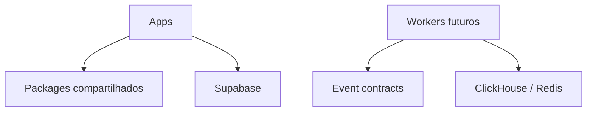

# Arquitetura da Foundation

## Planos do sistema

O Control Plane concentra autenticação, workspaces, configuração, billing e autorização. O Data Plane concentra ingestão, filas, normalização, jornadas e analytics de alto volume.

| Plano         | Fundação atual                        | Evolução prevista                        |
| ------------- | ------------------------------------- | ---------------------------------------- |
| Control Plane | Next.js, Supabase clients, env tipado | Auth, Workspace, RBAC, funis, billing    |
| Data Plane    | shells de serviços e contratos        | Cloudflare Workers/Queues/R2, ClickHouse |
| Plataforma    | monorepo, CI, health, observabilidade | deploys independentes e métricas         |

## Dependências permitidas

Apps podem consumir packages. Packages de domínio não devem importar apps. O browser consome apenas APIs autorizadas e clientes publicáveis.

## Decisões do EPIC 00

- `apps/web` é o único alvo Vercel.
- `apps/admin` permanece buildável, sem segundo projeto Vercel.
- Supabase remoto permanece sem schema de negócio.
- o health endpoint é raso e não depende de banco.
- observabilidade começa com JSON estruturado e abstrações sem fornecedor.
- packages e serviços futuros existem apenas como shells documentais.

## Próxima evolução

EPIC 01 deve introduzir Auth, Workspace e RBAC com isolamento multi-tenant no Postgres, RLS e testes de políticas.
